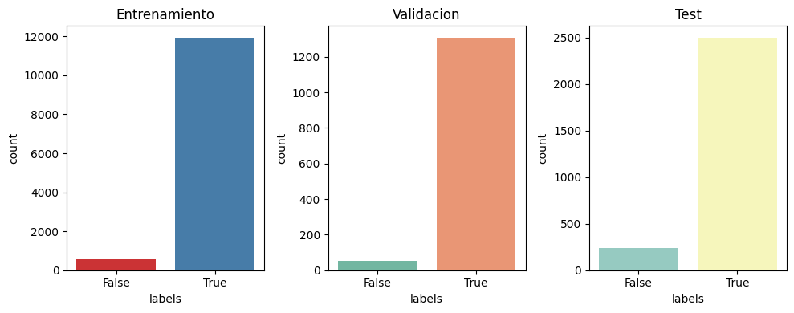

# Natural Language Processing 

En esta seccion se realiza el entrenamiento del un modelo tipo Transformer "Small Bert" para [Dataset Diplomacy](https://github.com/DenisPeskoff/2020_acl_diplomacy) los archivos resultantes son los siguientes:

* diplomacy_bert : Contiene el modelo tipo Bert entrenado, encargado de identificar si la oracion es verdadera o falsa

* 1_Preprocesamiento.ipynb : Notebook de prepreprocesamiento, toma los datos originales de una carpeta local y los transforma al formato de entrada del modelo de BERT

* 2_Entrenamiento_y_evaluacion.ipynb:  Notebook de entrenamiento y evaluacion del modelo, es el encargado de tomar el dataset procesado , realizar el entrernamiento, y hacer la validación

* diplomacy_format_beto.zip: Dataset diplomacy en formato de entrada BERT

* images: imagenes para esta documentación 

## Análisis global del problema 

Prueba propone implementar un modelo tipo transformer preentrenado y adaptarlo para que apartir del dataset Diplomacy [Dataset Diplomacy Github](https://github.com/DenisPeskoff/2020_acl_diplomacy) el modelo sea capaz de identificar si un texto es verdad o mentira, ademas el modelo debe ser entregado como parte de la prueba, por esta razon se decidio tomar una arquitectura tipo "BERT" pues tiene alto recorrido en la clasificacion de textos y cuenta con versiones "LITE" que permiten ser extraidos sin ocupar mucho espacio, otra aquitectura como GPT podria pesar mucho mas y no seria facil de exportar.

De esta forma se aborda el reto como un problema de clasificacion que tomara la variable "messages" como texto y la variable "labels" como la clase, la arquitectura de BETO esta enfocada en aprender los patrones de texto, por lo cual las otras variables no seran tomadas en cuenta para este ejercicio pero podria cosiderarse para una proxima exploracion buscar agrupar la decicion del modelo con otros modelo auxiliares entrenados con las otras variables.

Otro reto que se identifica en la prueba es el desbalanceo de los datos, mencionado desde el papper y evidenciado en la exploracion de los datos como se muestra en la siguiente imagen. Las muestras que son consideradas verdad (True) predominan en cantidad comparadas con las muestras consideradas mentira (False)



*Nota : Las consideraciones para la solucion del problema pueden verse al interior de los notebooks donde se detalla a mayor nivel cada uno de los pasos tomados para el entrenamiento*

## Resultados 

Para el entrenamiento del modelo se hicieron pruebas iniciales como linea base donde se entrena el modelo de "Bert" sin el balanceo de clases, esto generaba un modelo que aparentemente parecia muy bueno pero al verificar desde la matriz de confusion no era capaz de identificar ninguno de los textos encontrados como "Mentira", al ser un dataset desbalanceado todas las muestras eran clasificadas como la clase mayoritaria y esto hacia que el "Accuracy" fuera muy alto a pesar de no encontrar ninguna de las muestras de la clase minoritaria.

Para controlar esta problematica se procede a hacer el calculo de nuevos pesos que entraran por parametro al entrenamiento y que daran prioridad a las muestras de clase minoritaria.

De esta forma los resultados optenidos fueron los siguientes:

```
-------------------------------------------------------
F1 score por clase = [0.22101449 0.9127789 ]
-------------------------------------------------------
F1 Score Macro = 0.5668966987094688
-------------------------------------------------------

```
